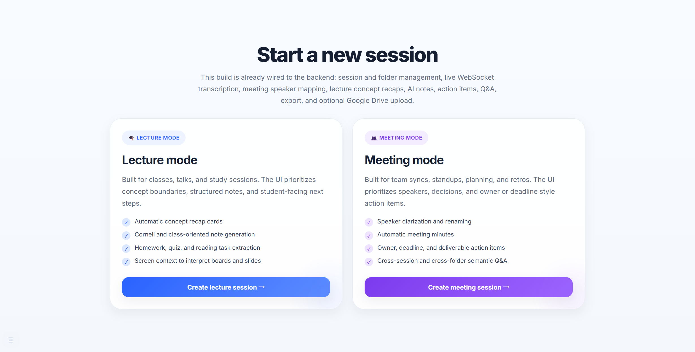
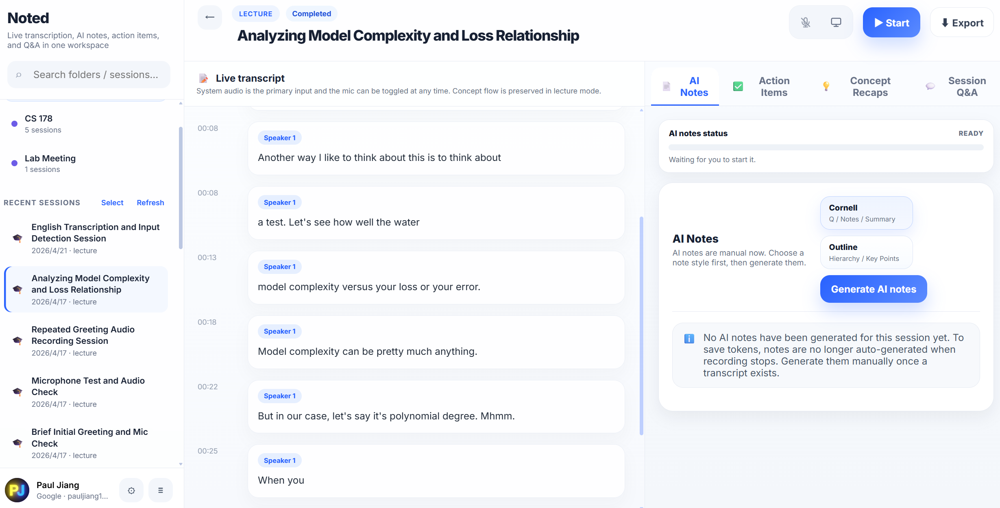
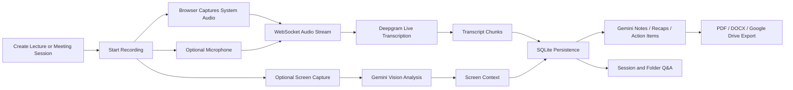
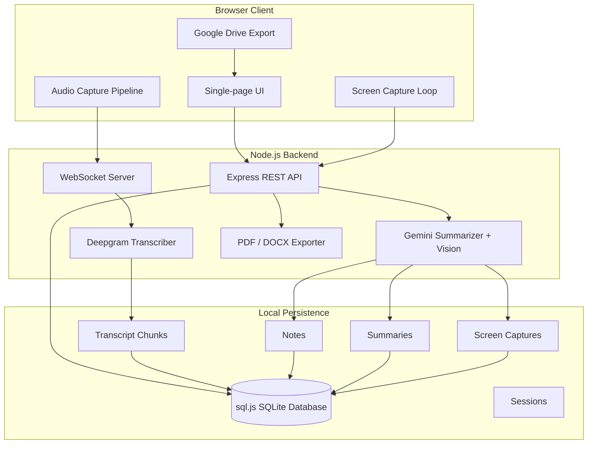

<div align="center">

# Noted

### Real-time transcription, AI notes, visual context, and searchable knowledge for lectures and meetings.

<p>
  <a href="#features"></a>
  <a href="#tech-stack"></a>
  <a href="#export"></a>
  <a href="#quick-start"></a>
</p>

<p>
  <b>Noted turns live audio and screen context into structured notes, action items, concept recaps, and searchable Q&A.</b>
</p>

<p>
  <a href="#why-noted">Why</a> •
  <a href="#features">Features</a> •
  <a href="#screenshots">Screenshots</a> •
  <a href="#architecture">Architecture</a> •
  <a href="#quick-start">Quick Start</a>
</p>

</div>

---

## Why Noted

Most transcription tools stop at raw text. Noted is built for the moment after transcription: turning messy, real-time audio into a usable knowledge workspace.

It supports two practical workflows:

- **Lecture Mode** — capture classes, talks, and study sessions; generate Cornell or outline notes; detect concept boundaries; extract student-facing reminders such as homework, quizzes, readings, and deadlines.
- **Meeting Mode** — capture syncs, standups, planning calls, and retros; use speaker diarization; rename speakers; generate meeting minutes; extract owners, deadlines, and deliverables.

Noted also uses optional screen capture analysis, so slides, diagrams, code walkthroughs, whiteboards, and shared-screen context can improve the final notes instead of being lost outside the transcript.

---

## Screenshots

<table>
  <tr>
    <td width="50%">
      <h3>Home Page</h3>
      
    </td>
    <td width="50%">
      <h3>Live Transcription</h3>
      
    </td>
  </tr>
</table>

---

## Features

### Live transcription

- Real-time WebSocket audio streaming from the browser to the backend.
- Deepgram-powered speech-to-text with interim and final transcript events.
- System audio as the primary input, with optional microphone mixing.
- Meeting-mode speaker diarization with editable speaker names.

### AI note generation

- Gemini-powered structured notes from transcript chunks and screen context.
- Lecture note styles:
  - Cornell Method
  - Outline Method
- Meeting note style:
  - Meeting Minutes
- Manual note generation to control cost and avoid unnecessary token usage.

### Visual context capture

- Optional screen sharing support.
- Periodic frame capture from the shared screen.
- Gemini vision analysis for slide text, diagrams, visual elements, and contextual clues.
- Visual context is stored alongside transcript data and used during note generation.

### Concept recaps

- Lecture-focused concept boundary detection.
- Automatic and manual concept recap generation.
- Recap cards include topic labels and time ranges.

### Action item extraction

- Lecture mode extracts class-facing tasks: assignments, readings, quizzes, exams, reminders, forms, office hours, and deadlines.
- Meeting mode extracts owner/deadline/deliverable-style action items.
- Extraction logs distinguish included vs. excluded candidates for better debugging and trust.

### Searchable Q&A

- Ask questions against the current session transcript.
- If a session belongs to a folder, Q&A can search across the folder’s sessions.
- Responses include source transcript snippets and timestamps.

### Organization

- Folder-based session organization.
- Drag-and-drop session moves.
- Searchable sidebar.
- Session title editing and AI-powered auto-title generation.

### Export

- Export generated notes as:
  - PDF
  - DOCX
- Optional Google Drive upload through Google Identity Services and Drive file scope.

---

## Product Flow



---

## Architecture



---

## Tech Stack

| Layer | Tools |
|---|---|
| Frontend | Vanilla JavaScript, HTML, CSS, Web Audio API, Screen Capture API |
| Backend | Node.js, Express, WebSocket `ws` |
| Transcription | Deepgram Live Transcription API |
| AI Reasoning | Gemini text generation and vision analysis |
| Database | `sql.js` SQLite persisted to `transcription.db` |
| Export | `pdfkit`, `docx` |
| Auth / Cloud Export | Google Identity Services, Google Drive `drive.file` scope |
| Utilities | `dotenv`, `uuid` |

---

## Quick Start

### 1. Install dependencies

```bash
npm install
```

### 2. Create environment variables

Create a `.env` file in the project root:

```bash
DEEPGRAM_API_KEY=your_deepgram_api_key_here
GEMINI_API_KEY=your_gemini_api_key_here
PORT=3000
```

### 3. Configure Google Drive export

Open:

```txt
public/google-drive-config.js
```

Replace the OAuth client ID if you want to use your own Google Cloud project:

```js
window.SCRIBE_CONFIG = Object.assign(
  {
    googleDriveClientId: 'your_google_oauth_web_client_id.apps.googleusercontent.com',
  },
  window.SCRIBE_CONFIG || {}
);
```

Google Drive export is optional. Local PDF and DOCX downloads work without Google Drive.

### 4. Start the app

```bash
npm run dev
```

Then open:

```txt
http://localhost:3000
```
---

## Roadmap

- [ ] Add login-backed cloud sync for sessions and notes.
- [ ] Add vector embeddings for stronger semantic retrieval.
- [ ] Add calendar integration for meeting metadata.
- [ ] Add note templates for research talks, office hours, interviews, and project standups.

---

<div align="center">

### Built for people who do not just want transcripts — they want usable memory.

<b>Noted</b> captures what happened, understands what mattered, and helps you act on it.

</div>
